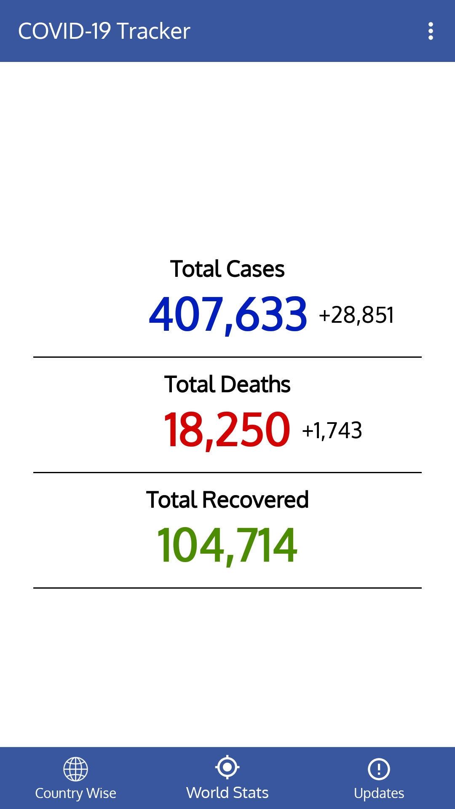

# COVID-19-Tracker

COVID-19 Tracker: The world has been taken over by the COVID-19 pandemic and this app is made to give realtime updates regarding the same.

The app provides the following functionalities -

1. Realtime statistics on the total positive cases, total deaths reported, total recovered patients, etc. filtered by countries.

2. Realtime news regarding COVID-19.

3. Notifications whenever the total cases and/or total death reports by coronavirus increases to an alarming amount.

4. Helpline numbers for all Indian states and union territory.

5. World statistics filtered only for a quick look to get an idea about total active cases and total deaths reported across the world.

6. List of trusted sources from where real-time data is synchronized

## Images
<table>  
  <tr></tr>
  <tr></tr>
  <tr></tr>
  <tr></tr>
</table>  
  
